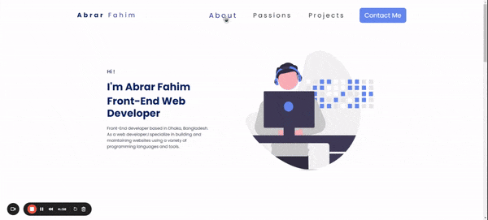

<h1 align="center">Bootstrap 5 - Portfolio Website</h1>
<h3 align="center">
  <a
    href="https://getbootstrap.com/docs/5.0/getting-started/introduction/"
    target="_blank"
    >Bootstrap 5</a
  >
  + <a href="https://en.wikipedia.org/wiki/HTML" target="_blank">HTML</a> +
  <a href="https://en.wikipedia.org/wiki/CSS" target="_blank">CSS</a>
</h3>

<br>
<p align="center"></p>
<h2 align="center"><a href="https://abfahim21.github.io/Uttara-patient-care-service/" target="_blank">Live Demo</a></h2>
<br>
<br>


## Sections

- [x] Navbar
- [x] Sidebar(mobile)
- [x] Hero
- [x] About
- [x] Footer

## Features

- [x] Fully Responsive Design

## How to install

1. Clone this repositoy:

```bash
git clone https://github.com/Abfahim21/Portfolio-2023--Bootstrap-V.git
```

2. Go to the Project

```bash
cd Portfolio-2023--Bootstrap-V
```

3. Run Project by opening index.html file

## Thank You
